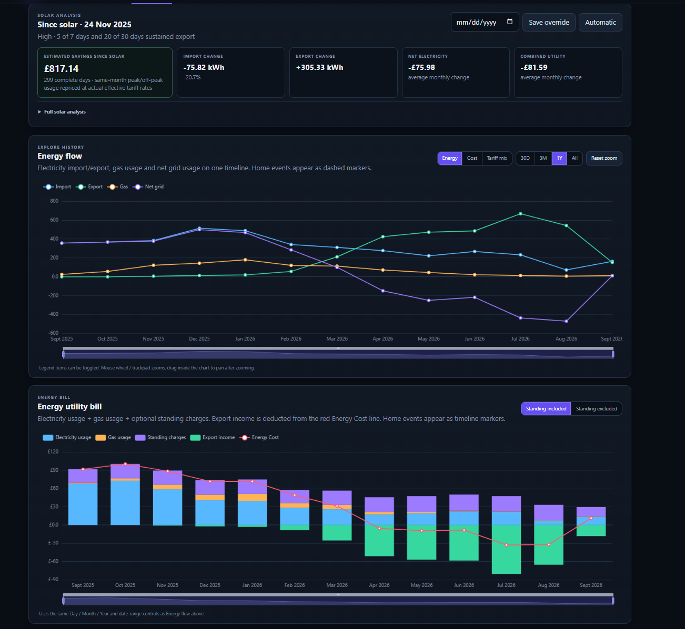

# Octopus Energy Dashboard

A self-hosted ASP.NET Core dashboard for detailed Octopus Energy history, tariff-aware costing, export income, gas, standing charges, Intelligent Octopus Go supplier allocations, and solar/battery impact analysis.

The project is designed for people who want a local, auditable view of their household energy data rather than another cloud dashboard.

## Dashboard preview



## Highlights

- Local SQLite history with raw supplier readings preserved.
- Electricity import/export, gas and standing charges in one dashboard.
- Exact/partial cost state: missing tariff evidence stays unavailable rather than being guessed.
- Intelligent Octopus Go four-rate allocation using supplier-calculated `gbrCostOfUsage` evidence.
- Allocation reconciliation against meter import before four-rate costs are trusted.
- Interactive day/month/year charts with zoom and Home Event markers.
- Solar-start detection plus same-month before/after analysis.
- Band-preserving estimated savings since solar, so historic peak-heavy usage is not magically repriced as today's off-peak usage.
- Year-on-year analysis and data-quality diagnostics.
- Background incremental sync plus explicit historical allocation backfill.
- Built-in single-admin login with salted password hashing and login throttling.

## Quick install

Target platform: a small Debian/Ubuntu-style Linux host, VM or LXC with systemd.

Build from source and install as a locked-down local web service:

```bash
git clone <your-repository-url>
cd <repository>
sudo ./deploy/install.sh
```

The installer requires the **.NET 9 SDK** to build from source. It publishes a self-contained `linux-x64` application, so the installed service does not require the .NET runtime afterward.

Defaults:

```text
Application: /opt/octopus-energy-dashboard
Data/key:    /var/lib/octopus-energy-dashboard
Service:     octopus-energy-dashboard
Listen:      http://127.0.0.1:8080
Timezone:    Europe/London
```

Then put nginx, Caddy, or another trusted reverse proxy in front of the localhost listener for LAN access.

See [docs/INSTALL.md](docs/INSTALL.md) for full installation, upgrade, reverse-proxy and uninstall instructions.
## First setup

Open the dashboard through your trusted LAN/reverse-proxy URL.

1. On first run, create the local administrator account. Passwords must be at least 12 characters and are stored only as salted hashes.
2. Open **Octopus Setup** and enter your Octopus API key.
3. Select **Discover account**.
4. Review discovered import/export electricity and gas meter configuration.
5. Run **Sync now**.
6. Use Advanced Overrides only if automatic discovery needs help.

The API key is stored in SQLite encrypted with AES-GCM. The random key is stored separately in the configured secret-key file. Back up **both** the database and the key.

## Security

The application includes a single local administrator login by default. Login attempts are rate-limited, and all dashboard/configuration pages require authentication; `/health` remains public for service monitoring. Trusted-LAN installations can explicitly opt out with `OCTOPUS_AUTH_DISABLED=1`.

The default installer still binds Kestrel to `127.0.0.1` only. Use HTTPS at the reverse proxy for remote access, and keep the application behind a trusted network, VPN, or equivalent access boundary.

See [docs/SECURITY.md](docs/SECURITY.md).
## Four-rate Intelligent Octopus Go

For supported four-rate import periods, the dashboard does not infer EV/home allocation from clock time and does not flatten the four supplier rates across whole-house consumption.

It stores supplier `gbrCostOfUsage` allocation evidence separately, reconciles each interval against the imported meter reading, and only promotes reconciled allocations into the effective cost view.

If allocation evidence is missing or inconsistent, pricing fails closed: usage remains visible but the affected cost is unavailable.

An explicit historical backfill is available:

```bash
sudo systemctl stop octopus-energy-dashboard
sudo -u octopus-energy \
  OCTOPUS_DATA_PATH=/var/lib/octopus-energy-dashboard/dashboard.db \
  OCTOPUS_SECRET_KEY_PATH=/var/lib/octopus-energy-dashboard/secret.key \
  /opt/octopus-energy-dashboard/JoakimHomeDashboard.Web --backfill-allocations
sudo systemctl start octopus-energy-dashboard
```
## Development

Requirements: .NET 9 SDK.

```bash
dotnet restore --configfile NuGet.Config
dotnet build JoakimHomeDashboard.sln -c Release
dotnet test JoakimHomeDashboard.sln -c Release
dotnet run --project src/JoakimHomeDashboard.Web
```

The executable schema lives in `DatabaseSchema.cs` plus the supplier-allocation schema in `SupplierAllocationStore.cs`.

## Project scope

This is a community/self-hosted project, not an Octopus Energy product. Octopus Energy and related product names are trademarks of their respective owners.

The software is provided as-is, with no guaranteed support. It is licensed under the GNU Affero General Public License v3.0 only (AGPL-3.0-only); see [LICENSE](LICENSE).